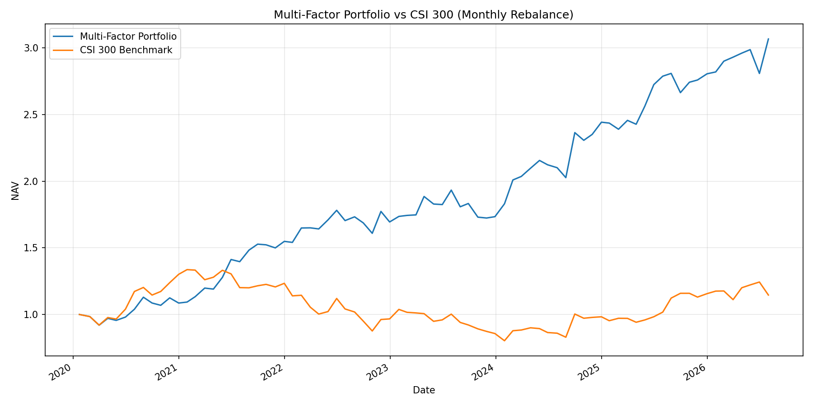
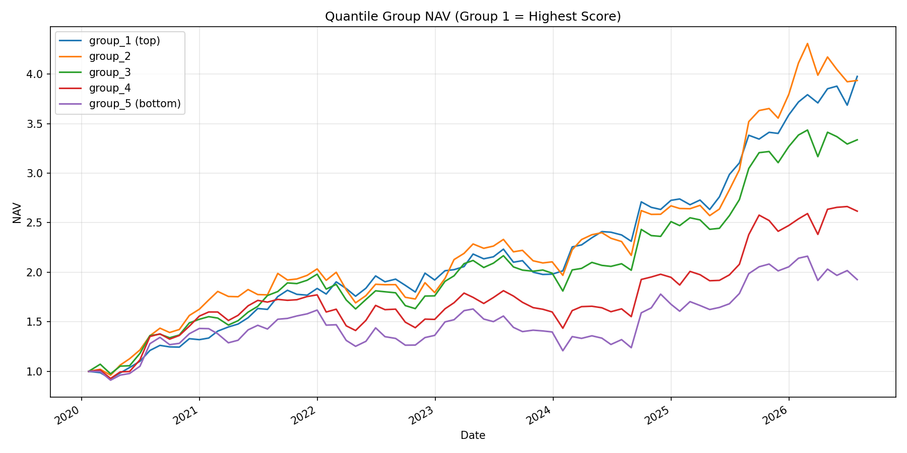
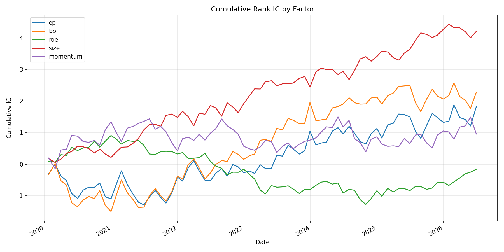
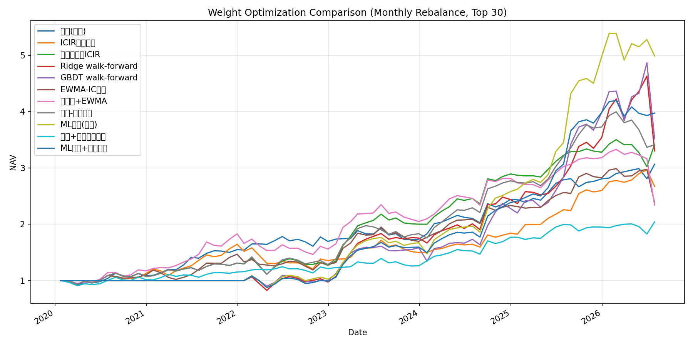

# Quant-Research-Fundamental-MultiFactor

A股量化研究项目 - **基本面多因子月度轮动策略**

在沪深300成分股内，用基本面五因子（价值 EP/BP、质量 ROE、小市值 Size、动量 Momentum）等权合成打分，每月末调仓，持有得分最高的30只股票，与沪深300基准对比。

## 策略逻辑

1. **股票池**: 沪深300成分股（约300只）
2. **因子构建**:
   | 因子 | 定义 | 方向 |
   |------|------|------|
   | EP | 1 / PE(TTM)，亏损股剔除 | 越大越好 |
   | BP | 1 / PB，破净为负剔除 | 越大越好 |
   | ROE | ROE(TTM)，累计加权ROE还原，按披露滞后对齐时点 | 越大越好 |
   | Size | -ln(总市值) | 市值越小越好 |
   | Momentum | 12-1月动量（252日收益剔除最近21日） | 越大越好 |
3. **因子预处理**: 每月末截面 MAD 去极值 + zscore 标准化
4. **合成**: 五因子等权加权（权重可在 `config/config.yaml` 调整）
5. **调仓**: 每月最后一个交易日，买入得分最高的30只，等权持有
6. **成本**: 佣金万三 + 印花税千一(卖出) + 滑点千一，按换手率计提

**ROE时点对齐**: 使用 `本期累计ROE + 上年年报ROE - 上年同期累计ROE` 还原TTM，并按财报披露法定期限（一季报+30天、半年报+62天、三季报+31天、年报+121天）滞后生效，避免未来函数。

## 数据来源

- 估值数据（PE/PB/总市值等日频，2018年起）: akshare `stock_value_em`（东方财富估值分析）
- 财务指标（季度加权ROE）: akshare `stock_financial_analysis_indicator_em`（东方财富财务分析）
- 基准指数: akshare `stock_zh_index_daily`（沪深300）
- 收益率由每日官方涨跌幅连乘构造，自动兼容除权除息

## 回测结果（2020-01 ~ 2026-07）

### 多头组合 vs 基准

| 指标 | 多头组合 (Top 30) | 沪深300 |
|------|------|------|
| 累计收益 | **+206.72%** | +14.59% |
| 年化收益 | **18.56%** | 2.09% |
| 年化波动 | 15.36% | - |
| 夏普比率 | 1.21 | - |
| 最大回撤 | -10.83% | -39.92% |
| 卡玛比率 | 1.71 | - |
| 平均月换手 | 12.91% | - |



### 分层回测（5分组，第1组得分最高）

| 分组 | 年化收益 | 夏普 | 最大回撤 |
|------|------|------|------|
| group_1 (top) | 23.33% | 1.50 | -11.43% |
| group_2 | 23.13% | 1.16 | -16.84% |
| group_3 | 20.08% | 1.07 | -17.72% |
| group_4 | 15.73% | 0.73 | -20.89% |
| group_5 (bottom) | 10.47% | 0.45 | -25.86% |

分组收益自上而下单调递减，因子区分度良好。



### 因子 Rank IC

| 因子 | IC均值 | ICIR | IC胜率 |
|------|------|------|------|
| size | +0.0540 | +0.301 | 60.3% |
| bp | +0.0292 | +0.102 | 56.4% |
| ep | +0.0234 | +0.083 | 47.4% |
| momentum | +0.0123 | +0.050 | 53.8% |
| roe | -0.0020 | -0.014 | 52.6% |



## 因子权重优化

除默认的等权合成外，项目实现了两代共九类权重优化方法（全部 walk-forward，严格使用时点前信息）：

**v1 基础方法**

| 方法 | 原理 |
|------|------|
| ICIR动态加权 | 权重 ∝ 滚动12个月ICIR（负值置零），自动降权失效因子 |
| 最大化组合ICIR | 基于因子IC均值/协方差矩阵（带收缩）的约束优化 (scipy SLSQP) |
| Ridge walk-forward | 滚动36个月训练岭回归，直接预测下期收益，系数≈自适应权重 |
| GBDT walk-forward | 直方图梯度提升树(sklearn HistGradientBoosting)，捕捉非线性交互 |

**v2 改进方法**

| 方法 | 原理 |
|------|------|
| EWMA-IC加权 | 指数衰减（半衰期6个月）的ICIR加权，近期信号权重更高 |
| 正交化+EWMA | 因子按 size→价值→质量→动量 逐层回归取残差，消除共线后再加权 |
| 均值-方差加权 | 因子多空组合真实月度收益 + Ledoit-Wolf收缩协方差，最大化夏普 |
| ML集成(收缩) | 扩展窗口 Ridge+GBDT 集成，截面标准化后向等权得分收缩30%降方差 |
| 逆波动率配权 | Top-N内部按过去63日波动率倒数配权（可叠加任意打分方法） |

```bash
python scripts/run_weight_optimization.py
```

### 对比结果（2020-01 ~ 2026-07，月度调仓 Top 30）

| 方法 | 年化收益 | 夏普 | 最大回撤 | 年化波动 | 月换手 |
|------|------|------|------|------|------|
| 等权(基准) | 18.56% | 1.21 | **-10.83%** | **15.36%** | 12.9% |
| ICIR动态加权 | 16.10% | 0.92 | -26.66% | 17.51% | 28.5% |
| 最大化组合ICIR | 20.53% | 1.08 | -20.69% | 19.05% | 16.5% |
| Ridge walk-forward | 19.89% | 0.81 | -28.72% | 24.52% | 16.1% |
| GBDT walk-forward | 21.04% | 0.82 | -27.77% | 25.76% | 28.7% |
| EWMA-IC加权 | 14.09% | 0.72 | -20.26% | 19.47% | 32.5% |
| 正交化+EWMA | 13.78% | 0.66 | -29.72% | 20.78% | 29.4% |
| 均值-方差加权 | 20.49% | 1.05 | -21.86% | 19.49% | 19.1% |
| **ML集成(收缩)** | **27.64%** | **1.21** | -19.50% | 22.93% | 19.8% |
| 等权+逆波动率配权 | 11.46% | 0.82 | -9.54% | 14.04% | 12.9% |
| ML集成+逆波动率 | 23.32% | 1.21 | -19.01% | 19.34% | 19.8% |

ML集成样本外（训练期结束后）: 年化 41.99%, 夏普 1.56；叠加逆波动率后波动降至19.3%。



**结论**:
- **ML集成(收缩)是风险调整后最优方案**：全区间夏普追平等权(1.21)但收益高近10个百分点，
  样本外夏普1.56全面领先。关键改进是：扩展窗口训练（避免滚动窗口遗忘历史）、
  目标值缩尾、Ridge/GBDT集成、向等权得分收缩30%降方差
- 逆波动率配权能显著降波动（ML集成叠加后 22.9%→19.3%，回撤-19.5%→-19.0%），
  但会稀释小市值高弹性股票的权重，绝对收益下降
- ICIR/EWMA/正交化类短窗口信号在本样本中均跑输等权，说明月频IC噪声大，
  因子层面的动态择权不如个股层面的非线性建模有效

## 项目结构

```
Quant-Research-Fundamental-MultiFactor/
├── config/config.yaml          # 全局配置（股票池/因子权重/回测参数）
├── data/
│   ├── raw/                    # 原始数据（parquet，已gitignore）
│   └── processed/              # 处理后数据
├── notebooks/                  # 研究notebook
├── results/
│   ├── reports/                # 回测报告与指标汇总
│   └── plots/                  # 图表
├── scripts/
│   ├── fetch_data.py           # 数据下载
│   └── run_backtest.py         # 一键回测
├── src/
│   ├── data/data_loader.py     # 数据获取与预处理
│   ├── factors/base.py         # 去极值/标准化
│   ├── factors/fundamental.py  # EP/BP/ROE/Size/Momentum 五因子
│   ├── factors/weight_optimizer.py  # 权重优化(ICIR/约束优化/ML walk-forward)
│   ├── backtest/engine.py      # 月度轮动回测引擎
│   ├── backtest/analyzers.py   # IC分析与报告生成
│   └── utils/helpers.py        # 工具函数
├── tests/                      # 单元测试(因子+权重优化)
├── requirements.txt
└── setup.py
```

## 快速开始

```bash
# 安装依赖
pip install -r requirements.txt

# 1. 下载数据（沪深300估值+财务+基准指数，约5分钟）
python scripts/fetch_data.py

# 2. 运行回测（产出报告、图表与指标）
python scripts/run_backtest.py

# 3. 权重优化方法对比（ICIR加权/约束优化/ML walk-forward）
python scripts/run_weight_optimization.py

# 4. 输出当前应持仓组合（默认ML集成打分，加 --equal-weight 切换等权）
python scripts/show_holdings.py

# 5. 运行单元测试
pytest tests/ -v
```

## 注意事项

- 成分股使用当前时点名单，存在幸存者偏差，历史回测结果偏乐观
- 财报披露滞后使用法定期限近似，未使用实际披露日期
- 净值为月末采样，期间回撤可能被低估
- 本项目仅为量化研究用途，不构成任何投资建议
